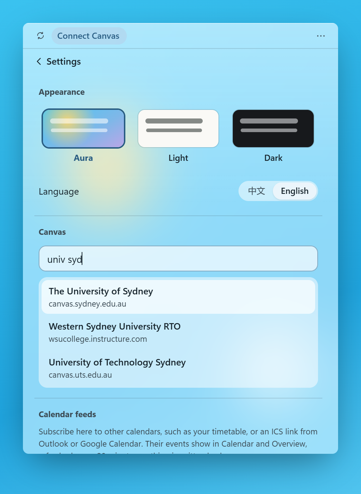
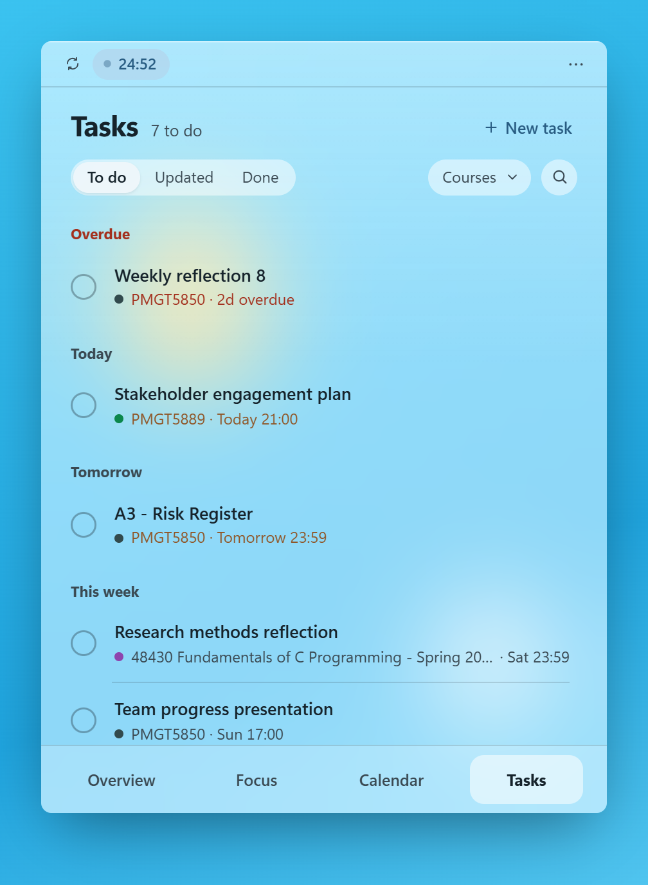
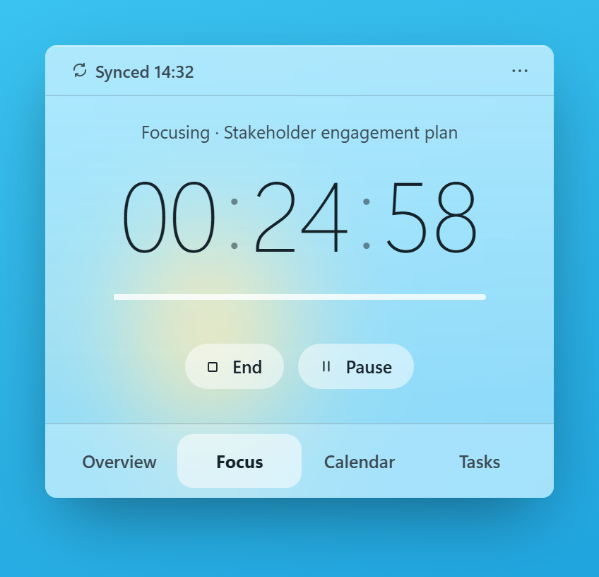
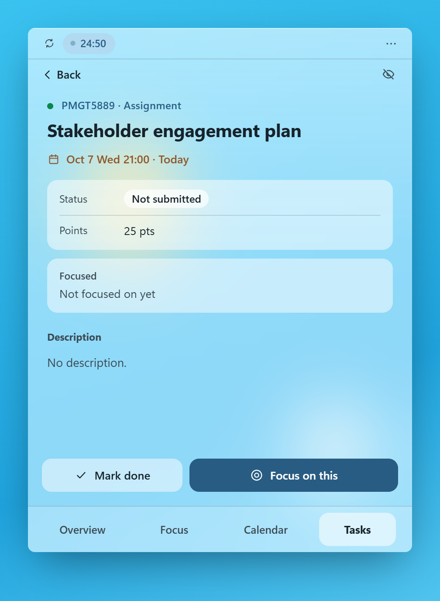
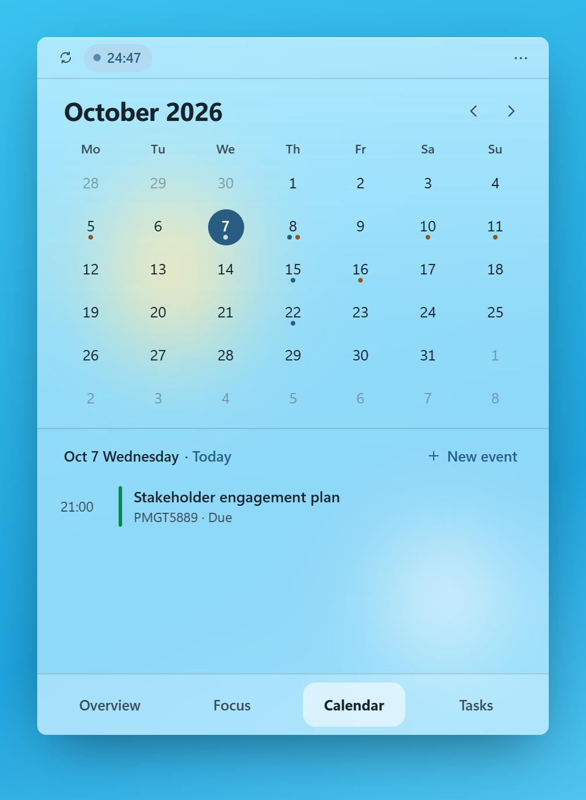
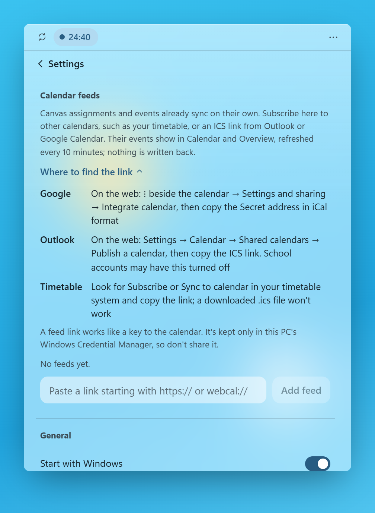
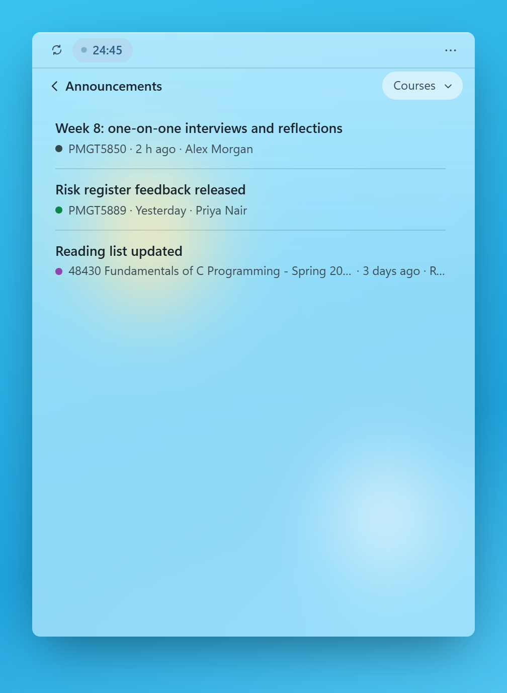
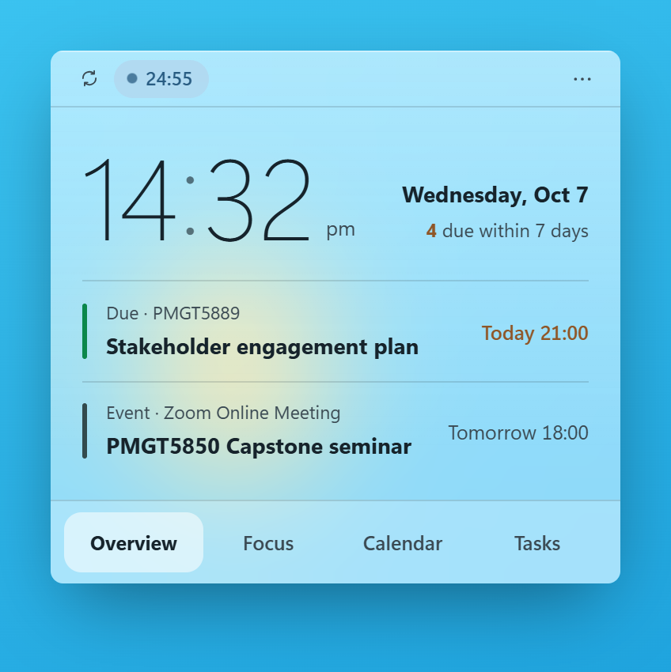
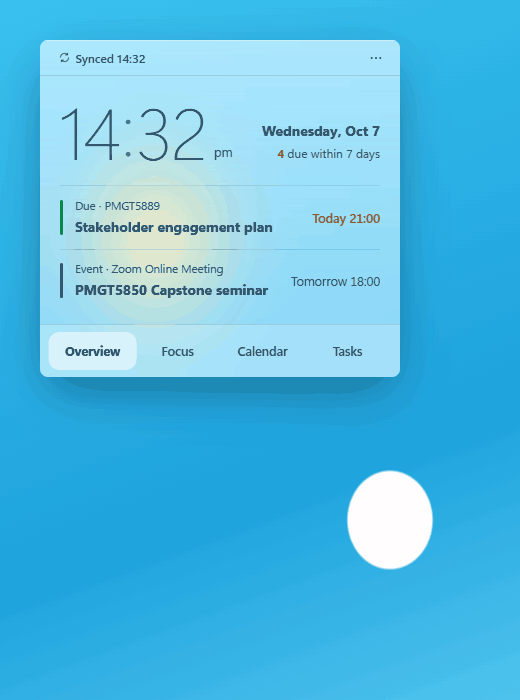
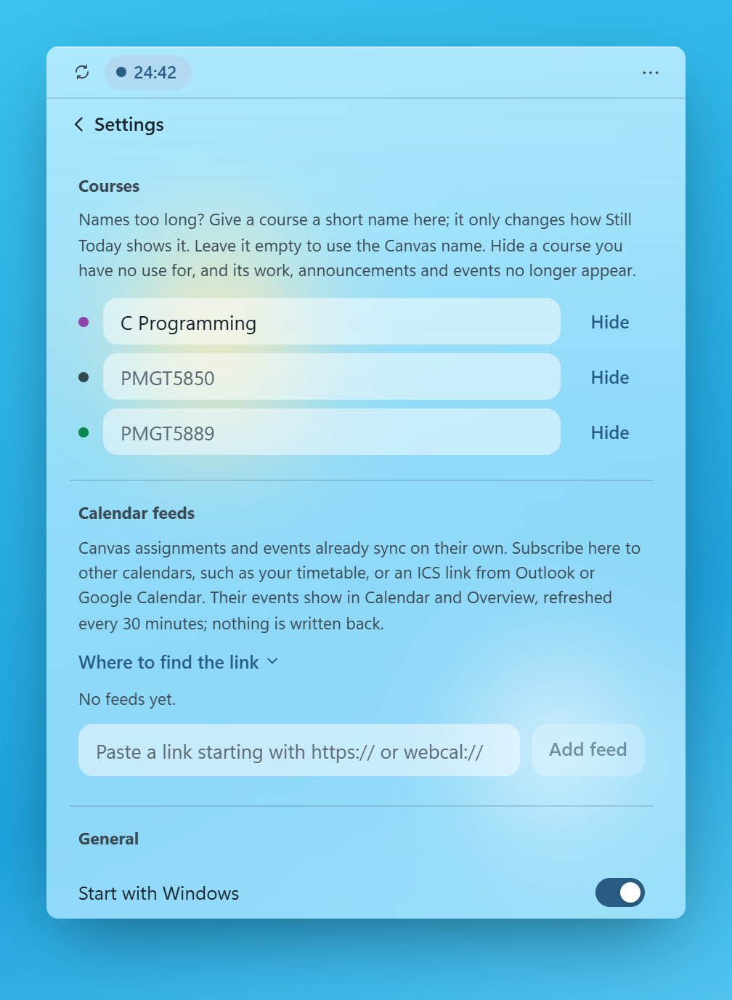

**English** · [中文](README.md)

# Still Today

Just want to see what's due, but have to open the browser, sign in and wait for a prompt on your phone every time?

Still Today is a small Windows desktop widget for students whose university uses Canvas, the learning platform many universities use for courses, assignments and announcements. It keeps your Canvas assignments, deadlines and class schedule on your desktop, so you know what today holds without opening the browser.

https://github.com/user-attachments/assets/0310065c-c8b7-49bc-8fc3-10a0d07fedda

The video's captions are in Chinese.

- **No browser.** Assignments, deadlines, your class schedule and announcements are on the desktop, a glance away.
- **Syncs on its own.** Every 10 minutes. Submitted work is ticked off, and a new grade or announcement brings a Windows notification.
- **Your data stays on your PC.** It reads Canvas with your own access token. No account, no server in between.

## What it does

### 1. Connect Canvas

- Type your school's name to find its Canvas, or paste your school's Canvas link if it isn't listed.
- Follow the three steps shown to create an access token, paste it in, and you're connected. You're reminded before the token expires.
- Some schools don't let students create tokens; if yours doesn't, Still Today can't connect for now.

| Finding Canvas by school name |
|:---:|
|  |

### 2. Assignments, from set to graded

- **Tasks:** every assignment and quiz from your courses, grouped by when it's due. Filter by course or search, and add tasks of your own.
- **Focus:** tie the timer to an assignment, and the time is recorded on it.
- **Hand in:** task detail has a button straight to the assignment on Canvas. Once you've submitted, it's ticked off at the next sync.
- **Grades and moved deadlines:** a posted grade brings a Windows notification and shows on the task. If a deadline moves, the list moves with it.

| Tasks | Focus | Task detail |
|:---:|:---:|:---:|
|  |  |  |

### 3. Calendar and announcements

- **Calendar:** the month view shows deadlines and Canvas course events. Add your own events too.
- **Feeds:** subscribe to your timetable, Outlook or Google Calendar. Settings explains where each keeps its feed link.
- **Announcements:** course announcements have their own page, with new ones marked and a Windows notification when they arrive.

| Calendar | Calendar feeds | Announcements |
|:---:|:---:|:---:|
|  |  |  |

### 4. Overview: today at a glance

- The time, your next deadline, your next class or event, and how much is due in the next 7 days.
- The header shows when you last synced; tap it to sync. Assignment updates, new announcements and a running focus timer show there too, and a sync error or a token expiring within 14 days comes first.

| Overview |
|:---:|
|  |

### 5. Look and settings

- The widget changes shape as you move between Overview, Tasks, Calendar and Focus.
- Three themes: Aura blurs the wallpaper behind the widget and picks light or dark text to match it; Light and Dark too.
- Rename a course whose Canvas name is too long, or hide one you don't need.
- Start with Windows, keep on top, lock its position, or hide it to the tray. Chinese and English.

| Switching views | Renaming a course |
|:---:|:---:|
|  |  |

## Install

1. Download `StillToday-<version>-win-x64-setup.exe` from [Releases](../../releases/latest).
2. Run it. It installs for your Windows user only and doesn't ask for administrator rights.
3. Windows may show **"Windows protected your PC"**. The installer isn't code-signed, so SmartScreen doesn't recognise it. Click **More info**, then **Run anyway**.
4. Open Settings in the widget and connect your school as in "Connect Canvas" above.

**Requirements:** Windows 10 (version 1903 or later) or Windows 11. It runs on .NET Framework 4.8 and the WebView2 Runtime, which Windows already has, so the installer is about 2.5 MB.

## Your data

- Everything stays on your PC. Still Today talks only to your Canvas and to the calendar feeds you add; there's no account and no server of mine in between.
- Tasks, focus history and settings are in `%LOCALAPPDATA%\StillToday`.
- Your Canvas token and calendar feed links are kept in Windows Credential Manager, not in a file.
- Uninstalling leaves your data in place, so reinstalling picks up where you were.

## Build from source

You'll need pnpm, the .NET 10 SDK, and, for the installer, Inno Setup 7.

```powershell
cd ui
pnpm install
pnpm dev        # the page in a normal browser, with a simulated desktop and sample data
pnpm test
cd ..
dotnet build host/StillToday.csproj -c Release
```

`scripts/packaging/Build-StillTodayInstaller.ps1` tests and builds everything and writes the installer to `artifacts/installer/`. [`packaging/README.md`](packaging/README.md) describes what it installs.

- `host/` is the Windows side: a borderless window that changes shape between views, the tray icon, the blur, notifications, storage and network access.
- `ui/` is the interface, in Svelte.
