[English](README.en.md) · **中文**

# Still Today

只是想看一眼作业，却每次都要打开浏览器、登录、再等手机验证？

Still Today 是一个 Windows 桌面小组件，给学校用 Canvas（海外高校常用的教学平台）的留学生。它把 Canvas 上的作业、截止时间和课程日程放在桌面上，不用打开浏览器，就知道今天要做什么。

https://github.com/user-attachments/assets/0310065c-c8b7-49bc-8fc3-10a0d07fedda

- **不用开浏览器**：作业、截止时间、课程日程和公告都在桌面上，看一眼就够。
- **自动同步**：每 10 分钟和 Canvas 同步一次。交了作业自动打勾，出分、新公告有 Windows 通知。
- **数据只在你的电脑上**：用你自己的 Canvas 访问令牌读取，没有账号，也没有中转服务器。

## 功能

### 1. 连接 Canvas

- 输入学校英文名就能找到学校的 Canvas，找不到也可以粘贴学校 Canvas 的网址。
- 按页面上的三步建一个访问令牌，粘贴进来就连上了（详细步骤见[连接 Canvas](#连接-canvas)）。令牌快到期时会提前提醒。
- 有些学校不允许学生创建令牌，这种情况暂时无法连接。

| 按学校名找到 Canvas |
|:---:|
| 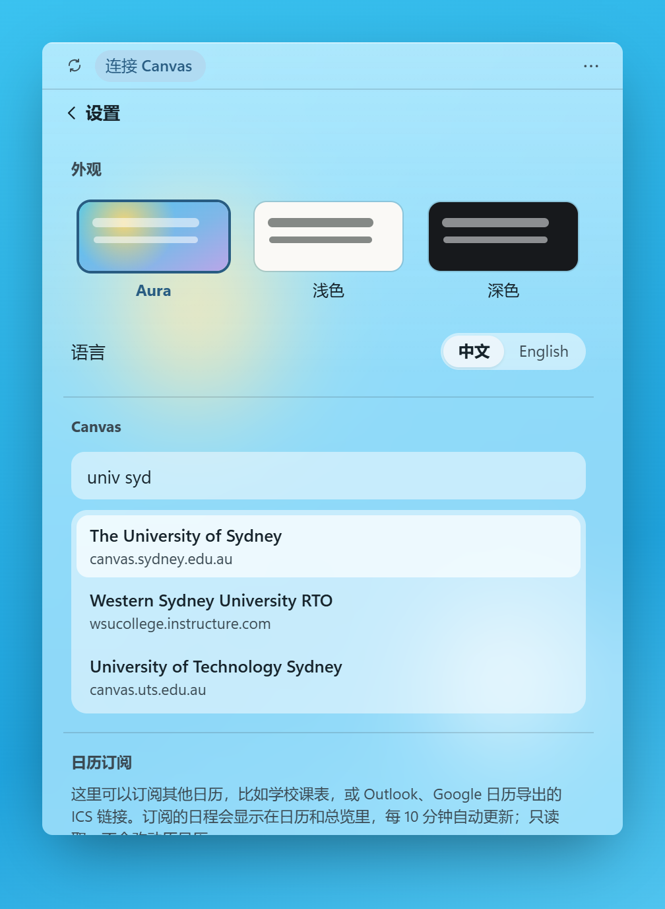 |

### 2. 作业：从布置到出分

- **任务列表**：所有课程的作业和测验按截止时间分组。可以按课程筛选、搜索，也可以加自己的任务。
- **专注**：计时器可以绑定到某项作业，专注的时长记在这项作业上。
- **提交**：任务详情里有直达 Canvas 的按钮。提交以后，下次同步时自动打勾。
- **出分和改期**：出分时有 Windows 通知，成绩显示在任务上。老师改了截止时间，列表里的时间也跟着改。

| 任务 | 专注 | 任务详情 |
|:---:|:---:|:---:|
| 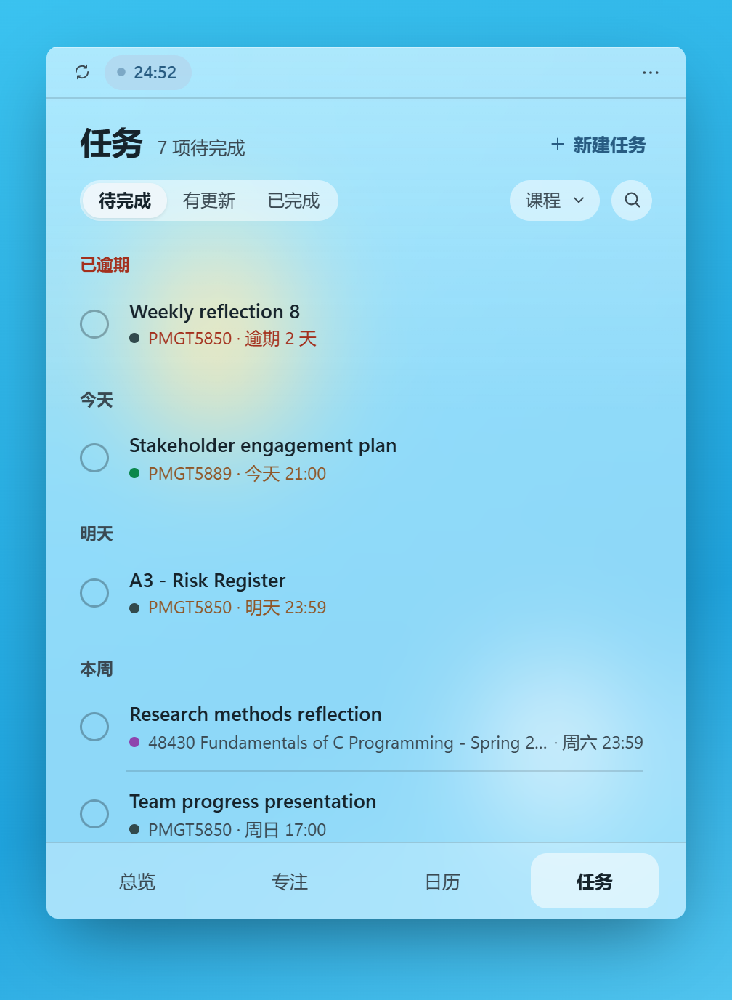 | 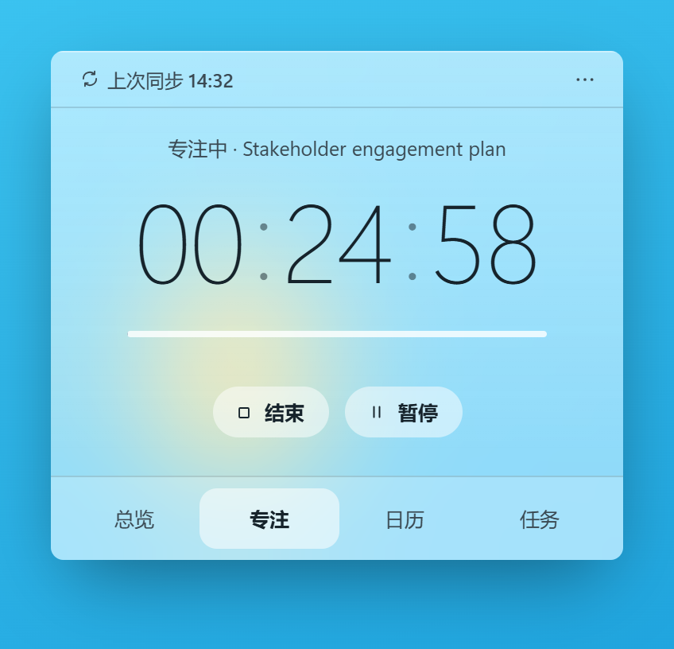 | 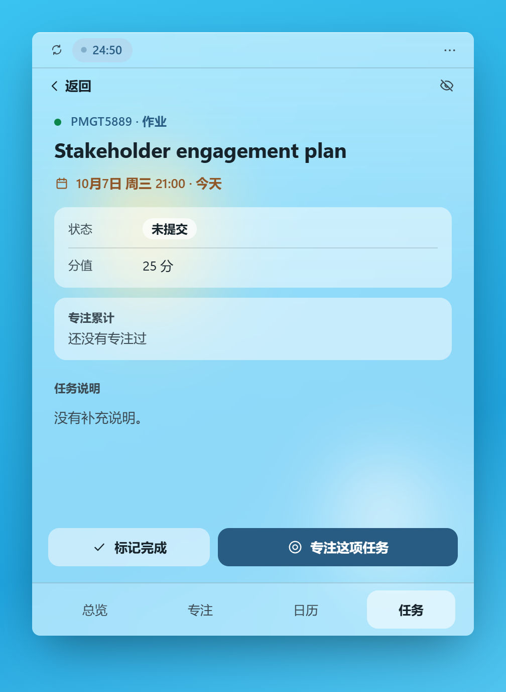 |

### 3. 日历和公告

- **日历**：月视图里有作业截止时间和 Canvas 课程日程，也可以加自己的日程。
- **订阅**：可以订阅课表、Outlook、Google 日历。设置里写明了各自的订阅链接在哪找。
- **公告**：课程公告单独一页，新公告有标记，也会发 Windows 通知。

| 日历 | 日历订阅 | 课程公告 |
|:---:|:---:|:---:|
| 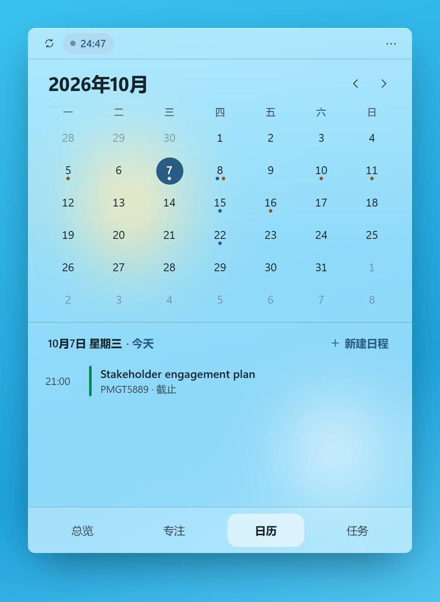 | 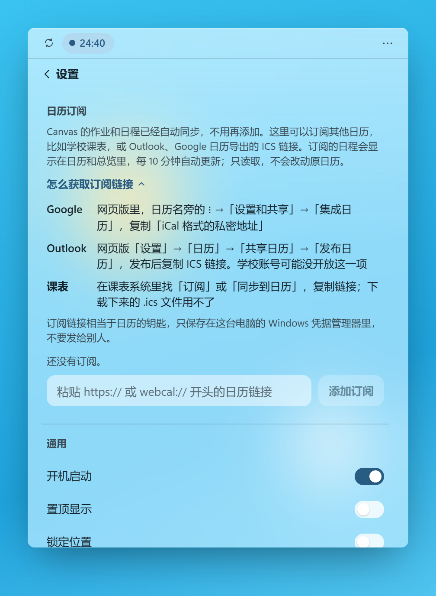 | 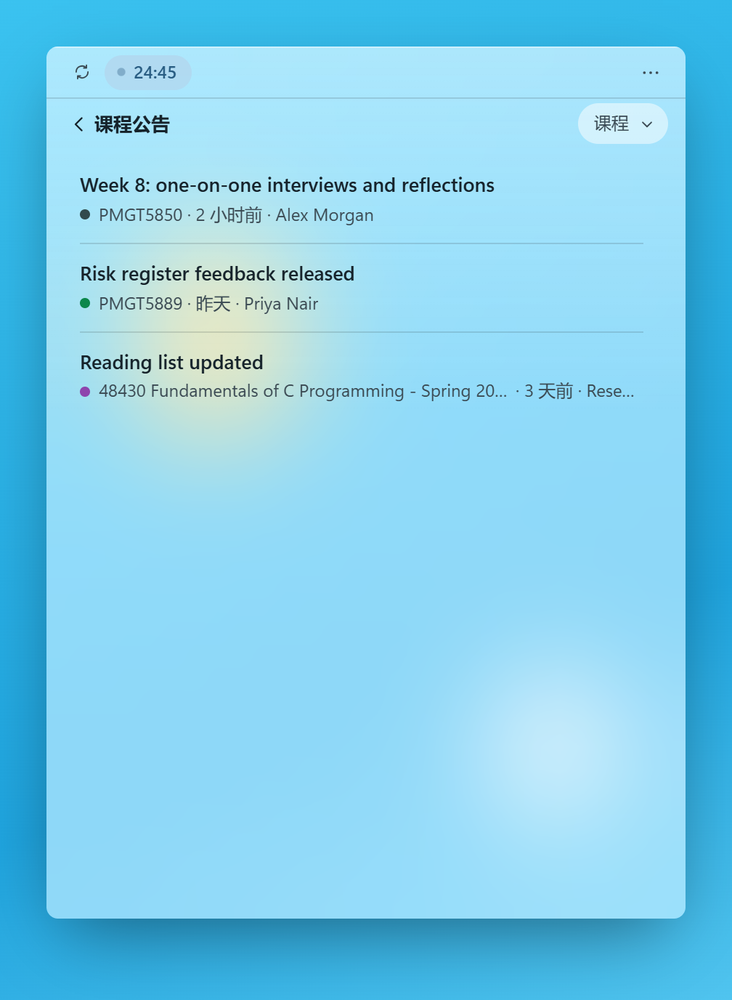 |

### 4. 总览：今天一眼看完

- 当前时间、下一个截止、下一节课或日程，以及 7 天内还有几项要交。
- 顶栏显示上次同步时间，点一下就同步。有作业更新、新公告或正在专注时，也显示在这里；同步出错或令牌 14 天内到期时，提醒排在最前。

| 总览 |
|:---:|
| 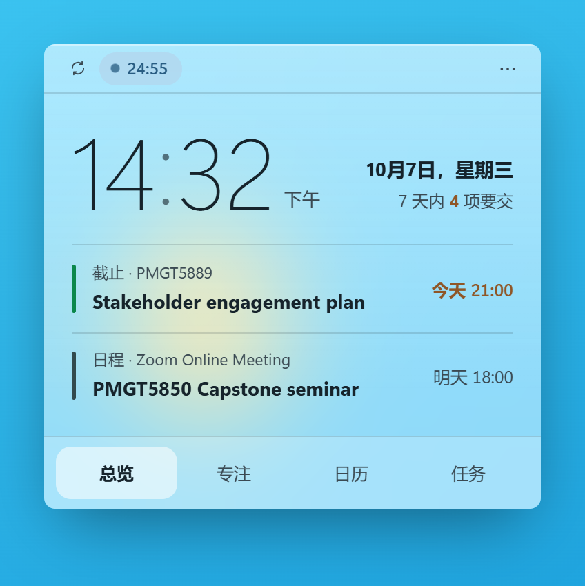 |

### 5. 外观和设置

- 在总览、任务、日历、专注之间切换时，小组件会变换形状。
- 三种主题：Aura 会模糊小组件背后的壁纸，并跟着壁纸选深色或浅色文字；另有浅色、深色。
- Canvas 课程名太长可以改名，用不上的课程可以隐藏。
- 开机启动、置顶显示、锁定位置，不用时可以隐藏到托盘。界面支持中文和英文。

| 切换视图 | 给课程改名 |
|:---:|:---:|
| 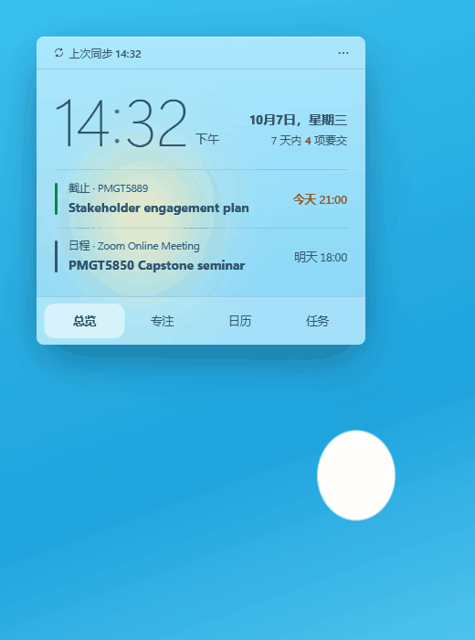 | 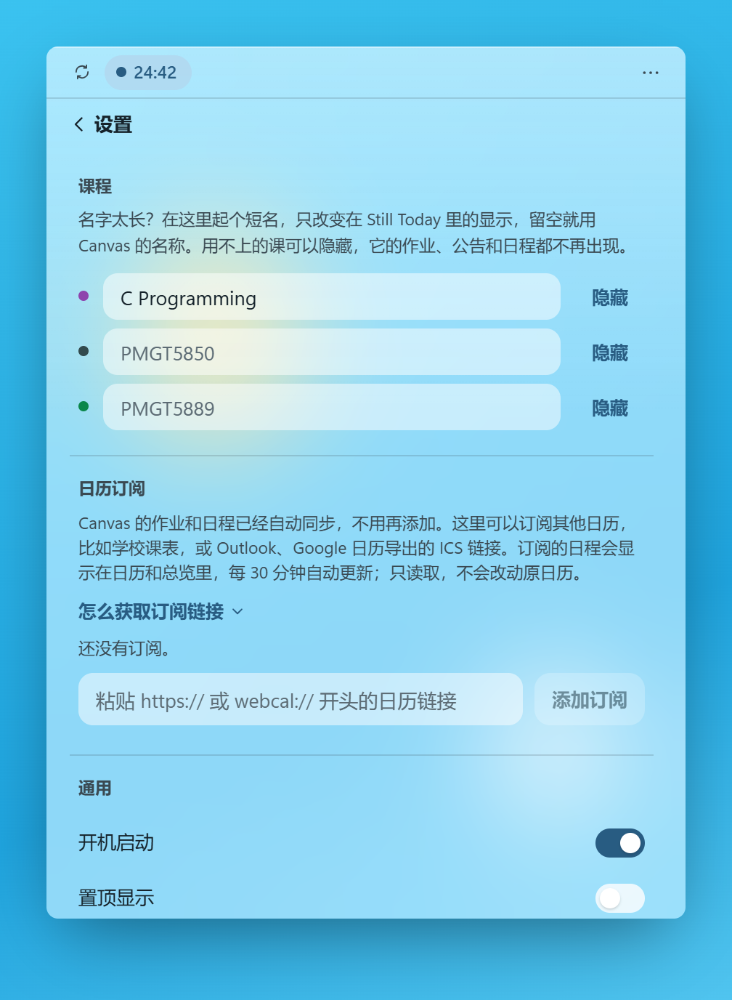 |

## 安装

1. 从 [Releases](../../releases/latest) 下载 `StillToday-<版本号>-win-x64-setup.exe`。
2. 运行安装包。它只为当前 Windows 用户安装，不需要管理员权限。
3. Windows 可能会提示 **"Windows 已保护你的电脑"**。这是因为安装包没有代码签名，SmartScreen 不认识它。点 **更多信息**，再点 **仍要运行**。
4. 按下面「连接 Canvas」的步骤连上你的学校。

**系统要求**：Windows 10（1903 或更高版本）或 Windows 11。它运行在系统自带的 .NET Framework 4.8 和 WebView2 Runtime 上，所以安装包只有约 2.5 MB。

## 连接 Canvas

装好以后，按下面四步把小组件连到你学校的 Canvas，只需要做一次。

### 第 1 步：找到你的学校

点小组件右上角的 **···** → **设置**，在 Canvas 一栏输入学校英文名，再点你的学校。比如悉尼大学，输入 `univ syd` 就能找到。列表里没有的话，直接粘贴学校 Canvas 的网址。


### 第 2 步：在 Canvas 里新建令牌

点 **打开 Canvas 设置**，浏览器会打开 Canvas 的 Settings 页面（没登录的话先登录）。往下翻，在已授权的外部软件（Approved Integrations）列表最下面找到 **+ New Access Token**，点它。

| 小组件里 | Canvas 设置页 |
|:---:|:---:|
| 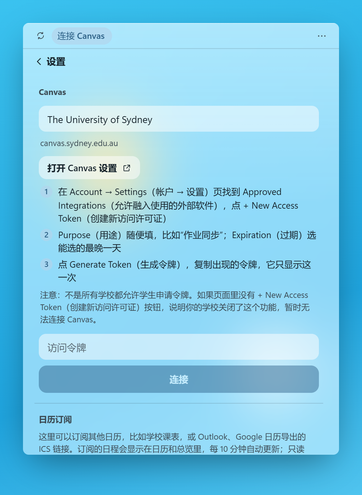 | 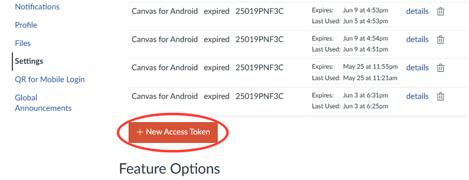 |

没跳到这个页面？在 Canvas 左边点头像 → **Settings**。

### 第 3 步：生成令牌并复制

1. **Purpose** 随便填，比如「作业同步」。
2. **Expiration** 选能选的最晚一天，时间随便。
3. 点 **Generate Token**，复制出现的令牌。**请立即复制，关掉之后令牌就再也看不到了。**

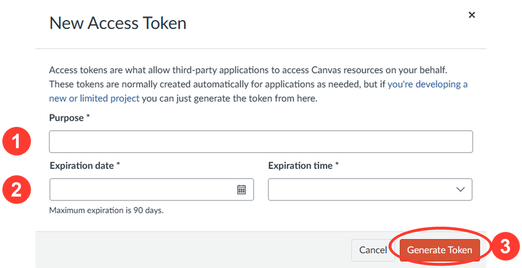

### 第 4 步：粘贴，连接

回到小组件，把令牌粘贴到「访问令牌」框里，点 **连接**。连上以后每 10 分钟自动同步一次。令牌快到期时，小组件会提前提醒你换一个新的。

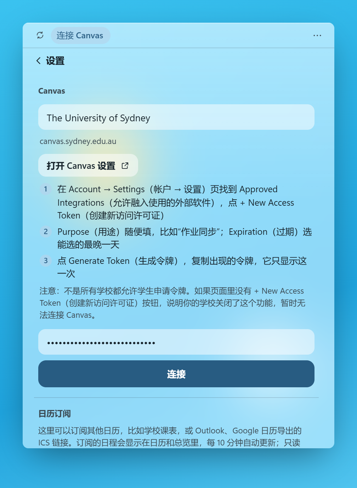

如果 Canvas 设置页里没有 **+ New Access Token**，说明你的学校不允许学生创建令牌，暂时无法连接。

## 你的数据

- 所有数据都在你的电脑上。Still Today 只连接你的 Canvas 和你添加的日历订阅，没有账号，中间也没有我的服务器。
- 任务、专注记录和设置保存在 `%LOCALAPPDATA%\StillToday`。
- Canvas 令牌和日历订阅链接保存在 Windows 凭据管理器里，不写进文件。
- 卸载不会删除数据，重新安装后一切照旧。

## 从源码构建

需要 pnpm、.NET 10 SDK；打包安装程序还需要 Inno Setup 7。

```powershell
cd ui
pnpm install
pnpm dev        # 在普通浏览器里运行界面，带模拟桌面和示例数据
pnpm test
cd ..
dotnet build host/StillToday.csproj -c Release
```

`scripts/packaging/Build-StillTodayInstaller.ps1` 会测试并构建全部内容，把安装包写到 `artifacts/installer/`。安装内容见 [`packaging/README.md`](packaging/README.md)。

- `host/` 是 Windows 这一侧：在不同视图间变换形状的无边框窗口、托盘图标、背景模糊、通知、存储和网络访问。
- `ui/` 是界面，用 Svelte 编写。
